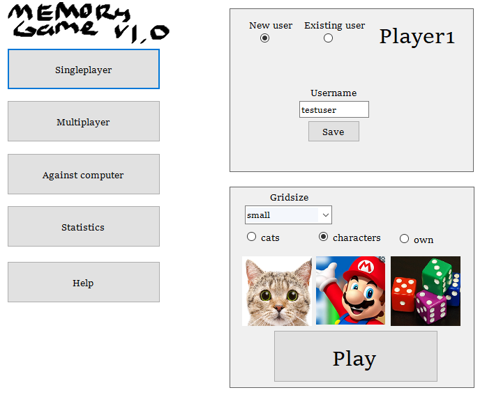
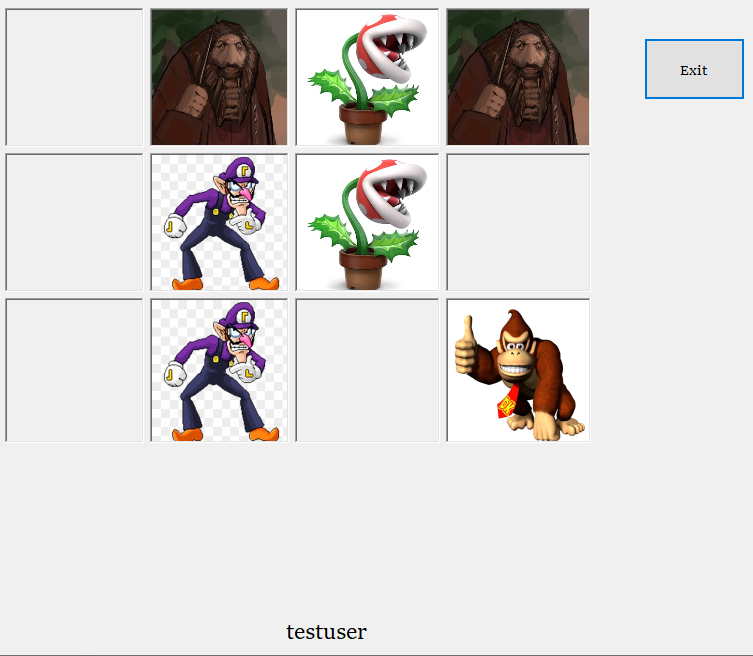
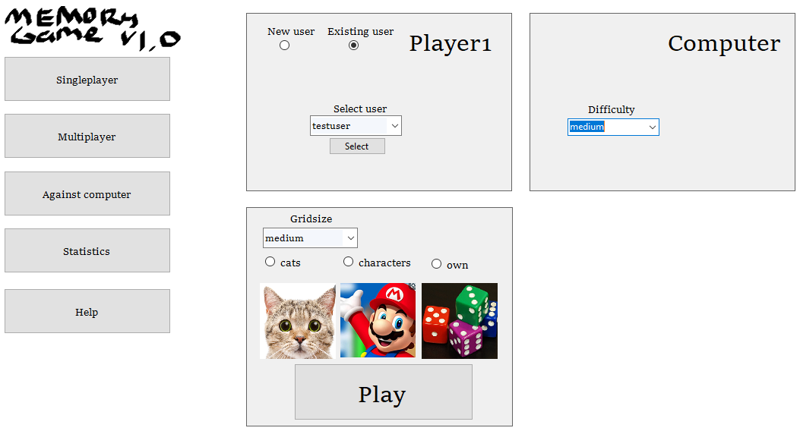
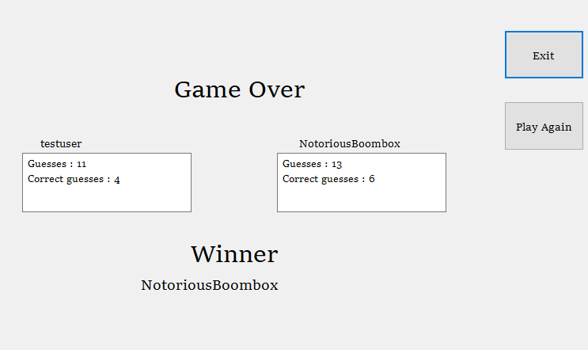
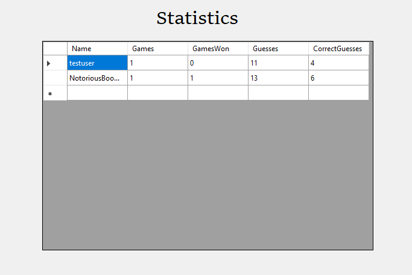
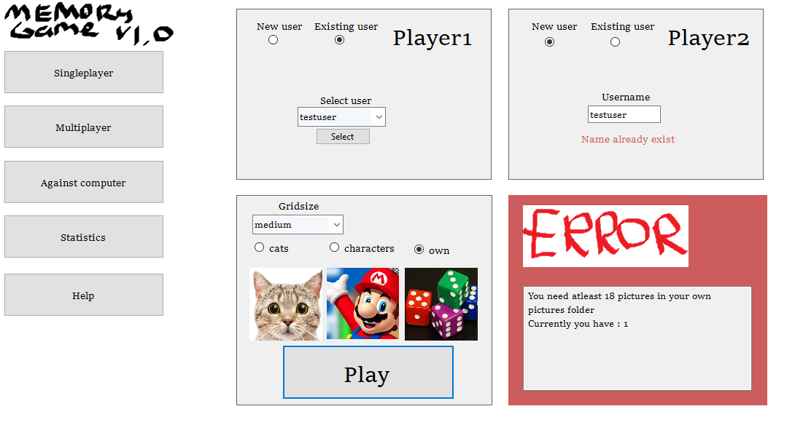

# MemoryGame

## Details

- Game randomises pictures to grid, you click one and guess another, if pictures match, you earn a point, otherwise turn is passed to another player

- Most correct guesses at the end wins and then you have possibility to play again with the same settings

- Three grid sizes available: small (3x4), medium (4x5) and big (6x6) 

- Choose card deck to be cats, characters, or use your own images (minimum 18 required)

### Singleplayer
- Practice by yourself, statistics are not saved, but at the end you see how many guesses were correct

  

### Multiplayer and vsComputer
- Play against friend or computer, after the game statistics are saved. Current player in turn is seen at bottom of the grid

  

### Statistics
- Stats are saved to "memorygamedata.txt" file located in %TEMP% folder. File is created if it doesn't exist
- Stats are updated after each game against other player or computer

  

### Error handling
Game handles certain errors:
- Player(s) must be selected before game starts according to selected mode (sp, mp, vsComputer)
- New user can't be created with existing name
- When using own cards, folder must contain atleast 18 pictures
- Deck must be selected

